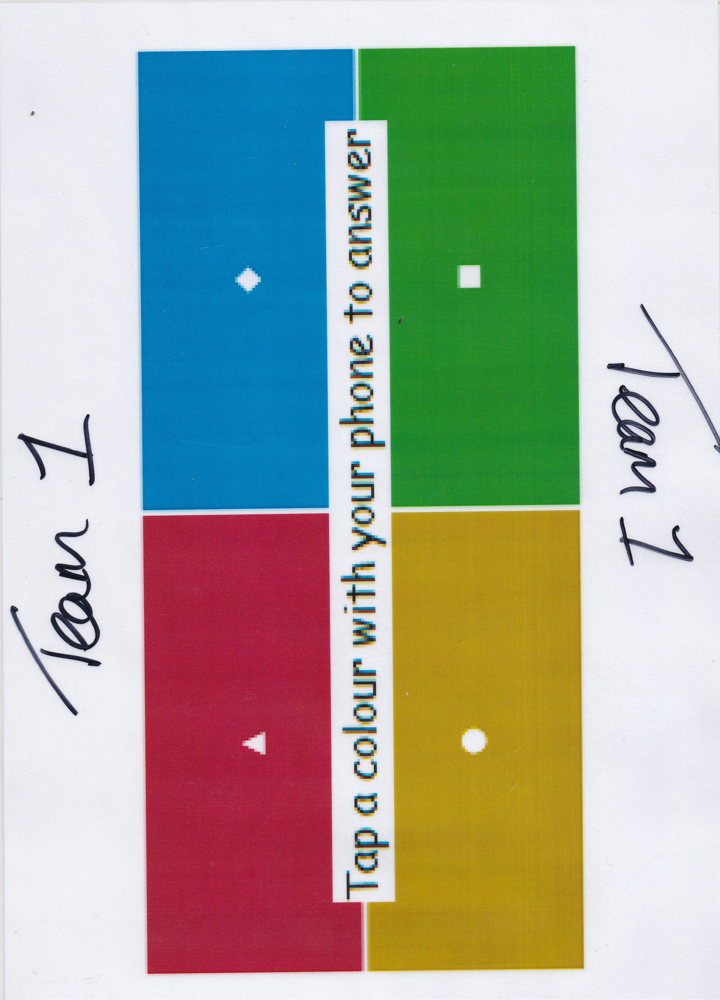
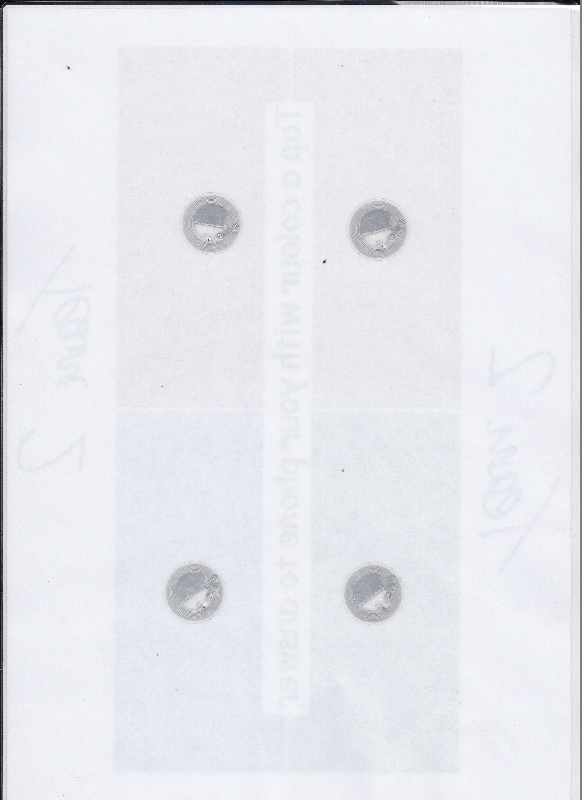

# RFID-Presentation
Interactive Presentation on RFID.


## How to show the presentation

In the presentation there are two interactive parts - which require PowerPoint VBA Macros turned on:

1. The first NFC tag demo - which will play the TechQuickie video which explains RFID on the third slide.
2. The final ‘Kahoot’-style game

**In order for the interactive parts to work, you must click on the black ‘Initialize’ button on the first slide. If should then change to read ‘Initialized.’ If it does not change after you’ve clicked on it, the interactive parts will not work.**


## Troubleshooting

- The PowerPoint does not seem to work in read-only mode so you may have to save it to your documents to proceed.
- After enabling Macros, you may have to close and re-open the PowerPoint for it to function correctly.
- If you get an error saying “_ERROR: The timer was running. It has now been stopped._” you should close and re-open the PowerPoint.


## How to create your own answer card





1. Design your answer card. It should have the four colors: `red`, `blue`, `yellow` (can be orange) and `green`. Ideally, it should be divided into quadrants.
   - You should mark out the center of each section in your answer card - this is where you will place the NFC sticker.
2. Purchase some NFC stickers to place on the answer card.
   - You can buy 10 stickers for around £8 from Amazon: https://www.amazon.co.uk/dp/B01DHFBNJG/
3. Place the NFC stickers on the back of the answer card.
   - You should place the center sticker as close to your marker or the center of your color section as possible.
   - It might be worth mentioning on the card that it’s worth practicing with scanning the stickers and working out where your phone’s NFC reader is.


## How to self-host the PHP code

1. Upload the contents of `/rfid-presentation-php` to the root or a directory within your webserver. Remember which directory you have uploaded *the contents* to.

2. Open the presentation, and show the VBA window by pressing <kbd>Alt</kbd> + <kbd>F11</kbd>. In the project sidebar, expand the `Modules` folder.

3. Open `Module1` and find the following line:

   ```vb
   Public Const APIEndpoint As String = "..."
   ```

4. Change the value of `APIEndpoint` to match your webserver address - **including the path you have uploaded the PHP code to:**

   Example: `https://api.samjakob.com/rfid-presentation/`


## How to change the questions

**You must currently self-host the presentation in order to change the questions.**

1. Navigate to the directory containing the PHP code.

2. Open the file `questions.json` and modify the questions.

   - The question format is as follows:

     ```json
     {
         "question": "...",
         "answers": {
             "red": "...",
             "yellow": "...",
             "blue": "...",
             "green": "..."
         },
         "correct": "red"
     }
     ```

   - `correct` should match one of the answer colors.

3. Ensure the file is a JSON array (i.e. that you have `[ ` at the start of the file and `]` at the end of the file.)

4. Save your changes and start the PowerPoint.